<!-- more-->

参考:
[+](https://blog.csdn.net/qq_50854790/article/details/123321425)
[++](https://xz.aliyun.com/t/10942)

## 前言

在y4师傅的博客看到这个 搜索发现这是一个经典(漏洞百出)的CMS审计入门
跟着文章一起学

## 环境配置

没必要本地配环境 Fofa找个在线的本地审了远程验证即可
这里找到一个[xhcms](http://114.115.204.132:1111/)


## Seay自动审计

先用工具扫一遍
随便一扫一大堆...
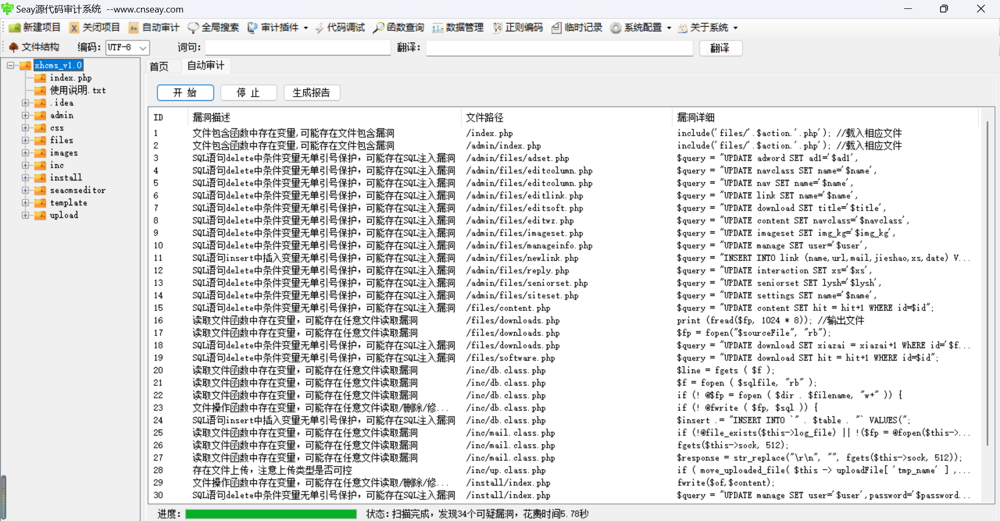


## 0x1. index.php 文件包含漏洞

**/index.php**

```php
<?php
//单一入口模式
error_reporting(0); //关闭错误显示
$file=addslashes($_GET['r']); //接收文件名
$action=$file==''?'index':$file; //判断为空或者等于index
include('files/'.$action.'.php'); //载入相应文件
?>
```

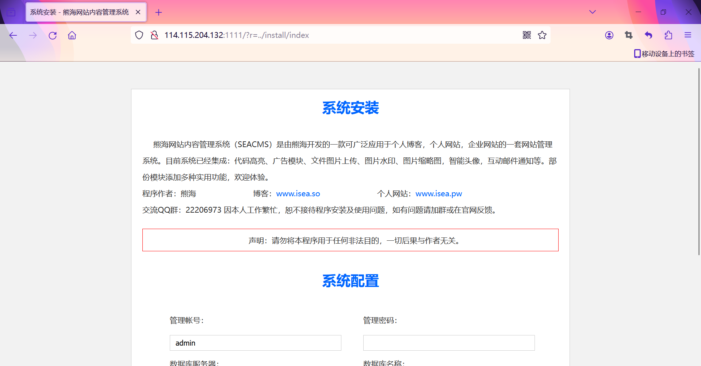

**/admin/index.php**同理

## 0x2. /admin/files/xxx.php sql注入漏洞

一大堆...
注意一个点 这些访问路由都要 `host/admin/?r=xxx`来访问

/admin/files/login.php (这个是没有扫出来的)
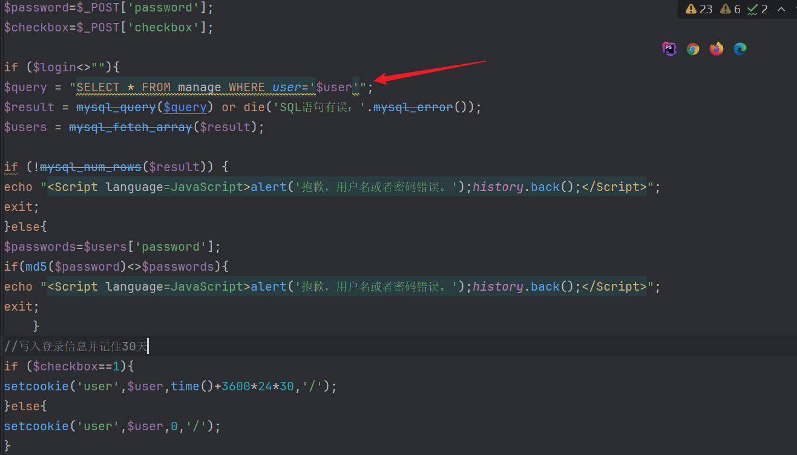

没有任何waf
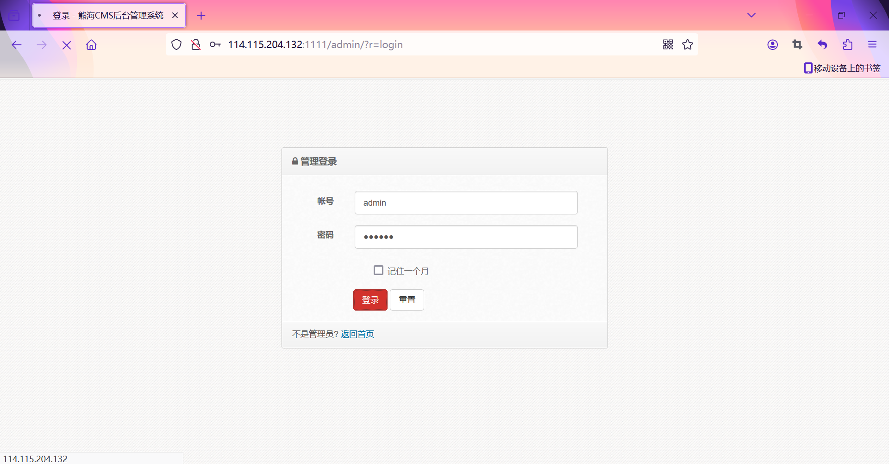
直接sqlmap一把梭
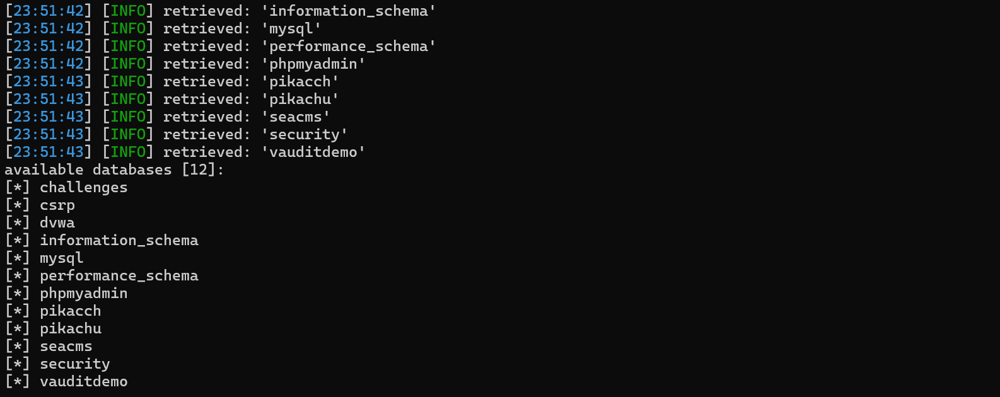

对于Seay扫出来的那一大堆sql注入也同理 但这些是要登录后再注入 不如login直接

接下来就看看有没有能登陆后台的漏洞来利用

## 0x3. /inc/checklogin.php 越权漏洞

```php
<?php
$user=$_COOKIE['user'];
if ($user==""){
header("Location: ?r=login");
exit;	
}
?>
```

直接从cookie中获取user信息 尝试改为admin或root
bp抓包 访问/admin 修改cookie发现直接就登陆后台了...
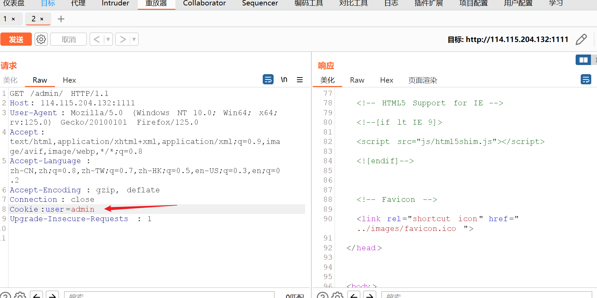
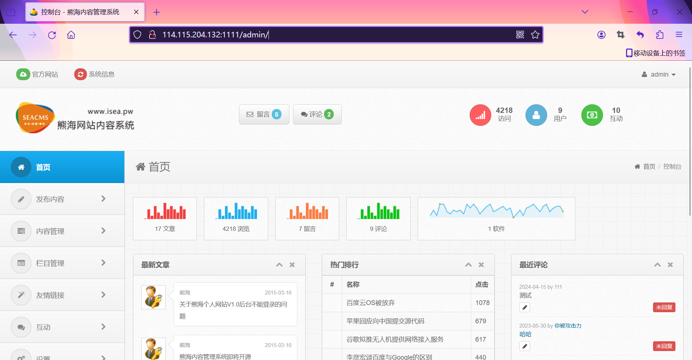

所以以后的请求只要带上cookie:user=admin即可
可以发现这网站已经被审计过好多次了哈哈

## 0x4. 后台任意文件下载漏洞

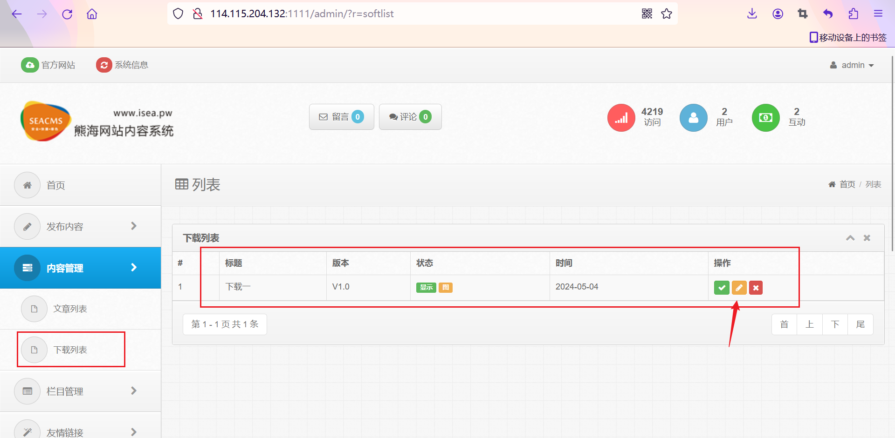

把softadd填为/etc/passwd 保存后就能下载
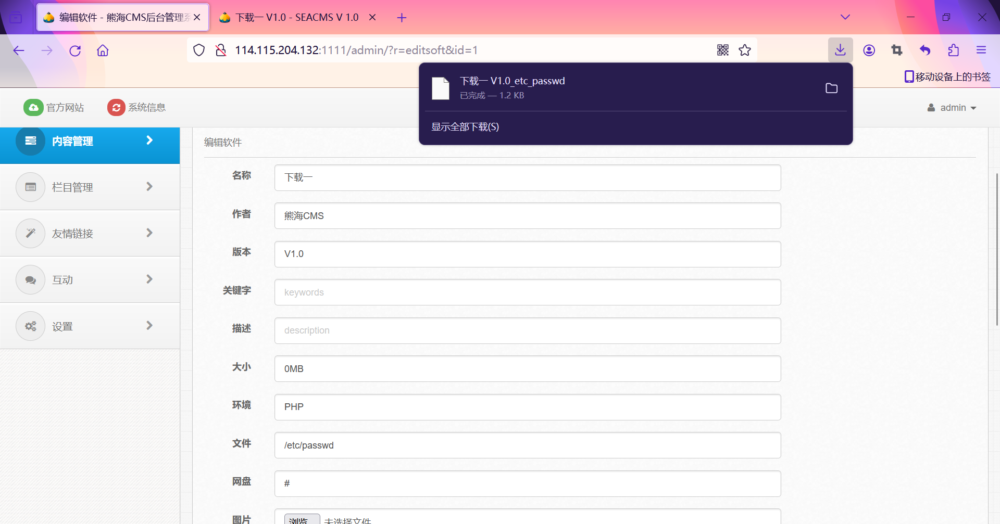

## 0x5. 多处xss漏洞

**/files/contact.php**
反射型xss

```php
12: $page=addslashes($_GET['page']);
...
139: <a>第 <?php echo $page?> - <?php echo $Totalpage?> 页 共 <?php echo $Total?> 条</a>
```

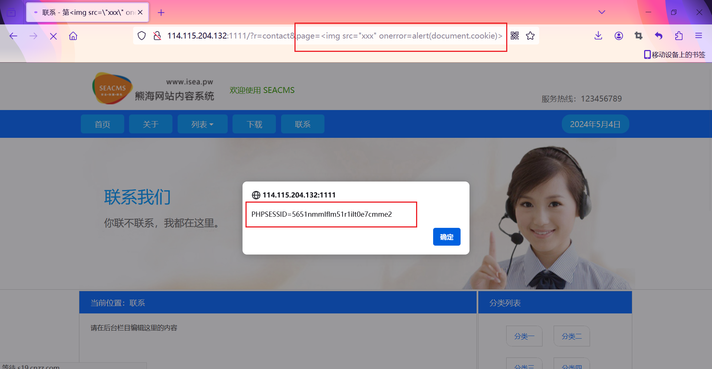

**/admin/files/manageinfo.php**
存储型xss

```php
<?php
require '../inc/checklogin.php';
require '../inc/conn.php';
$setopen='class="open"';
$query = "SELECT * FROM manage";
$resul = mysql_query($query) or die('SQL语句有误：'.mysql_error());
$manage = mysql_fetch_array($resul);

$save=$_POST['save'];

$user=$_POST['user'];
$name=$_POST['name'];
$password=$_POST['password'];
$password2=$_POST['password2'];
$img=$_POST['img'];
$mail=$_POST['mail'];
$qq=$_POST['qq'];

if ($save==1){
	
	
if ($user==""){
echo "<script>alert('抱歉，帐号不能为空。');history.back()</script>";
exit;
	}
	
if ($name==""){
echo "<script>alert('抱歉，名称不能为空。');history.back()</script>";
exit;
	}
if ($password<>$password2){
echo "<script>alert('抱歉，两次密码输入不一致！');history.back()</script>";
exit;
	}

//处理图片上传
if(!empty($_FILES['images']['tmp_name'])){
$query = "SELECT * FROM imageset";
$result = mysql_query($query) or die('SQL语句有误：'.mysql_error());
$imageset = mysql_fetch_array($result);
include '../inc/up.class.php';
if (empty($HTTP_POST_FILES['images']['tmp_name']))//判断接收数据是否为空
{
		$tmp = new FileUpload_Single;
		$upload="../upload/touxiang";//图片上传的目录，这里是当前目录下的upload目录，可自已修改
		$tmp -> accessPath =$upload;
		if ( $tmp -> TODO() )
		{
			$filename=$tmp -> newFileName;//生成的文件名
			$filename=$upload.'/'.$filename;
			$imgsms="及图片";
			
		}		
}
}

if ($filename<>""){
$images="img='$filename',";	
}

if ($password<>""){
$password=md5($password);
$password="password='$password',";
}

$query = "UPDATE manage SET 
user='$user',
name='$name',
$password
$images
mail='$mail',
qq='$qq',
date=now()";
@mysql_query($query) or die('修改错误：'.mysql_error());
echo "<script>alert('亲爱的，资料".$imgsms."设置已成功更新！');location.href='?r=manageinfo'</script>"; 
exit;
}
?>
```

POST传参 只判断了是否为空 没有其他的waf 而后面直接与数据库交互 所以存在存储型xss
虽然我也没怎么搞明白怎么触发的 换成改账号就触发不了
必须保证账号是admin好像
我的理解是更新了名称后前端又渲染了一次 就导致了xss触发罢

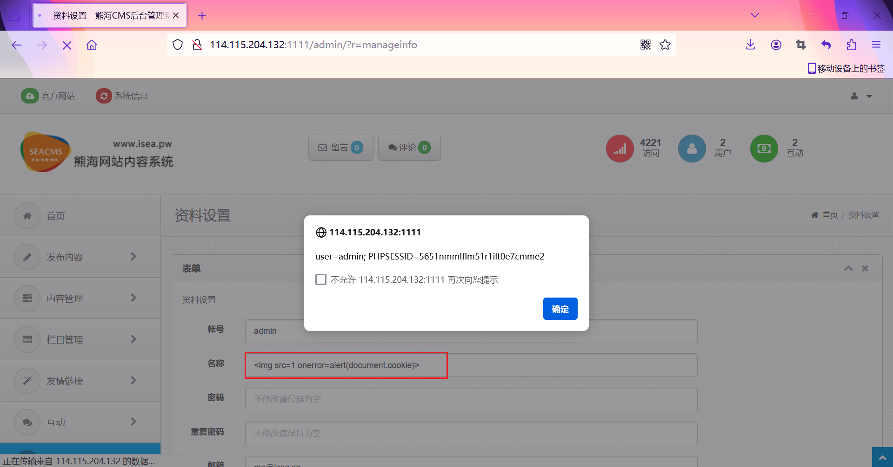

